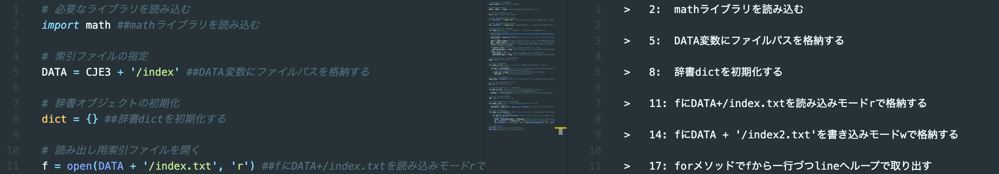
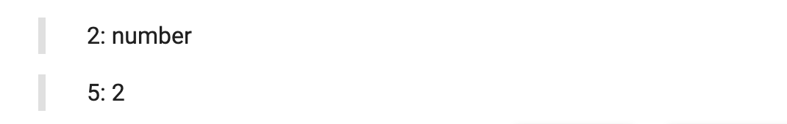

# Closed (Please develop fork project)

---

# cjeReportingTool



This tool made for CJE(Chishiki Joho Enshu 3) class at Univ. Tsukuba, klis.
This package converts source code comment to markdown text using split words.

> ja:
> 筑波大学 KLIS の CJE3 のマークダウン形式の小レポート用ライブラリです。
> 特定の文字列`##`や`#$`等をコメントに用いると，その記号を用いたコード行末に書いたコメントのみを行番号と合わせて出力します。

## Requirement

This package does not require on other any packages.

## Installation

This package runs on Python 3.6 or higher version. You can install it from PyPI via pip:

> ja:
> このパッケージは Python 3.6 以上で動作します。
> また pip コマンドで以下のようにインストールできます。

```bash
pip install cjeReportingTool
```

to install.

## Usage

To use this tool as a package, load as a function.

```python
import cjeReportingTool.cjeReportingTool as c

c.cjeReportingTool(path, outpath, split_str, prefix)
```

Each args:

- `path` Read file path
- `outpath` Export file path
- `split_str` A symbol or string that separates comments from source code
- `prefix` Prefixes to be written out

To use this command as a command,

```bash
$ cjerep -h
usage: cjeReportingTool [-h] path outpath split_str prefix

This Tool made for CJE(Chishiki Joho Enshu 3) class at Univ. Tsukuba, klis.
This package converts source code comment to markdown text using split words.

positional arguments:
  path        Read file path
  outpath     Export file path
  split_str   A symbol or string that separates comments from source code
  prefix      A Prefix to be written out

optional arguments:
  -h, --help  show this help message and exit

$ cjerep sample.py out.md
```

## Example

- File

```text
.
├── sample.py
├── out.md
└── main.py
```

---

- Read file `sample.py`

```python
# num
i = 1 ##number
n = i * 2
# output
print(n) ##2
```

- Main program `main.py`

```text
import cjeReportingTool.cjeReportingTool as c

c.cjeReportingTool('sample.py', 'out.md', '##', '>')
```

---

- Output file `out.md`

```text
1   > 2: number
2
3   > 5: 2
```



### Note

`split_str` uses a string other than the spelling of the symbols used your python code.

- Good: `##`, `#&`, `#$`, `#%`
- Bad: `#` (No difference from other comments), `$` (That's not comment)

## License

This software is released under the MIT License, see LICENSE.
show all <https://github.com/murataka9/cjeReportingTool/blob/main/LICENSE>
